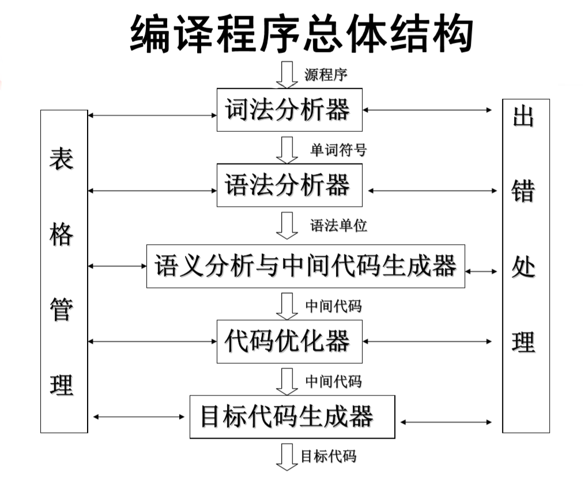

## 编译程序的总体结构

编译程序通常由以下几个阶段组成：


1. **词法分析**：由词法分析器完成，从左到右扫描组成源程序的字符串，并将其转化成单词串，将发现的标识符登记到符号表中，检查组词方面的错误并进行处理。（Lex 是词法分析程序的自动生成工具）
2. **语法分析**：由语法分析器完成，分层给出程序的组成结构，指出语法错误，制导语义翻译。（Yacc 是语法分析程序的自动生成工具）
3. **语义分析**：由语义分析器完成，分析由语法分析程序识别出来的语法成分的语义。
4. **中间代码生成**：由中间代码生成器完成，以中间代码的形式实现对语义分析结果的表示。
5. **代码优化**：由代码优化器完成，对中间代码进行优化处理。
6. **目标代码生成**：由目标代码生成器完成，完成从中间代码到目标机器上的机器指令代码或者目标机器上的汇编代码的转换。
7. **出错处理**
8. **符号表管理**

---

## 概念辨析与关键定义

|   名词   | 定义                                                                     |
| :------: | :----------------------------------------------------------------------- |
|   句型   | 从开始符号出发，经过零步或多步推导得到的符号串                           |
|   句子   | 由终结符组成的句型                                                       |
|   短语   | 如果句型中的某一段符号串，是从某个非终结符推导出来的，那么这一段就是短语 |
| 直接短语 | 某个非终结符一步推导出来的短语                                           |
|   句柄   | CFG 文法中句型的最左直接短语                                             |
|  素短语  | 包含终结符的最小短语                                                     |

### 语法分析方法

- **自顶向下的语法分析方法**：预测分析法、递归下降分析法
- **自底向上的语法分析方法**：（移进-归约分析、优先法、状态法）、算符优先分析法（识别句柄）、LR 分析法，包括：
  - LR(0) 分析法
  - SLR(1) 分析法
  - LR(1) 分析法
  - LALR(1) 分析法

### LR(0) 项目

设 $A \to \alpha X \beta$ 是文法 $G = (V, T, P, S)$ 中的一个产生式，则 $\text{LR}(0)$ 项目分为：

- **归约项目**：$A \to \alpha X \beta .$
- **移进项目**：$A \to \alpha . X \beta$ 且 $X \in T$
- **待约项目**：$A \to \alpha . X \beta$ 且 $X \in V$
- **接受项目**：$S' \to S .$

### Chomsky 体系

1. 0 型文法：也称为**短语结构文法**；
2. 1 型文法：也称为**上下文有关文法**，对于 $\forall \alpha \to \beta \in P$，均有 $|\alpha| \leq |\beta|$；
3. 2 型文法：也称为**上下文无关文法**，对于 $\forall \alpha \to \beta \in P$，均有 $|\alpha| \leq |\beta|$，并且 $\alpha \in V$；
4. 3 型文法：也称为**正则文法**，对于 $\forall \alpha \to \beta \in P$，均有如下形式，其中 $A, B \in V$，$w \in T^+$
   - $A \to w$
   - $A \to wB$

对于 $\forall \alpha \to \beta \in P$，均有如下形式：

- $A \to w$
- $A \to Bw$

其中 $A, B \in V$，$w \in T^+$，则称该文法为**左线性文法**。相对应，对于 $\forall \alpha \to \beta \in P$，均有形式 $A \to w$ 或 $A \to wB$，则称该文法为**右线性文法**。可以证明，左线性文法和右线性文法等价，因此统称为正则文法。

### 语法制导翻译及属性

- **语法制导定义**：附带有属性和语义规则的上下文无关文法。
- **语法制导翻译模式**：语法制导定义的一种便于实现的书写形式。翻译模式中的属性同样与文法符号相关联，但是语义规则（语义动作）用花括号 { } 扩了起来，并可被插入到产生式右部的任何合适的位置上。
- **综合属性**：节点的属性值是通过分析树中该节点或其子节点的属性值计算出来的。
- **继承属性**：节点的属性值是通过分析树中该节点、该节点的兄弟节点或父节点的属性值计算出来的。

### 指令开销

|  寻址模式  |   汇编语言形式   |                地址                | 增加的开销 |
| :--------: | :--------------: | :--------------------------------: | :--------: |
|  绝对地址  |    $\text{M}$    |             $\text{M}$             |     1      |
|   寄存器   |    $\text{R}$    |             $\text{R}$             |     0      |
|    下标    |  $c (\text{R})$  |     $c + contents(\text{{R}})$     |     1      |
| 间址寄存器 |   $* \text{R}$   |        $contents(\text{R})$        |     0      |
|  间址下标  | $* c (\text{R})$ | $contents(c + contents(\text{R}))$ |     1      |
|   直接量   |      $\# c$      |                $c$                 |     1      |

记忆：只有寄存器和间址寄存器的寻址模式开销为 0，其他寻址模式的开销都为 1。  
指令的开销设定为 1 加上源寻址模式和目的寻址模式的开销。

### 正则表达式

| 自然语言约束 |     正则写法      |
| :----------: | :---------------: |
|   一个字母   | `L` 或 `[A-Za-z]` |
|   一个数字   |  `D` 或 `[0-9]`   |
|  零个或多个  |       `x*`        |
|  一个或多个  |   `x+` 或 `xx*`   |
|    x 或 y    |      `x\|y`       |

**基本运算：**

- `|`：选择，表示 x 或 y
- `*`：闭包，表示零个或多个 x
- `+`：正闭包，表示一个或多个 x，可以等价于 `xx*`
- `?`：可选，表示零个或一个 x，可以等价于 `x|ε`

### 运行时的存储组织

- **访问链**：又称**静态链**，用来访问存放在其他活动中的非局部数据。
- **控制链**：又称**动态链**，用来指向调用者的活动记录。当过程调用结束后返回时，利用动态链可以得到调用前的活动记录的起始地址。
- **调用序列**：负责分配活动记录，并将相关信息填入活动记录中。
- **返回序列**：负责恢复机器状态，使调用过程能够继续执行。

---

## FIRSTOP 与 LASTOP

### 1. FIRSTOP

$\text{FIRSTOP}(A)$ 表示从 $A$ 推导出的句型中，第一个可能出现的终结符集合。

**计算规则：**  
对每个产生式右部进行扫描  
如果有产生式 $A \to a...$，则 $a$ 加入 $\text{FIRSTOP}(A)$  
如果有产生式 $A \to B a...$，则 $a$ 加入 $\text{FIRSTOP}(A)$  
如果有产生式 $A \to B...$，则 $\text{FIRSTOP}(B)$ 加入 $\text{FIRSTOP}(A)$

### 2. LASTOP

$\text{LASTOP}(A)$ 表示从 $A$ 推导出的句型中，最后一个可能出现的终结符集合。

**计算规则：**  
从产生式右部末尾看  
如果有产生式 $A \to ...a$，则 $a$ 加入 $\text{LASTOP}(A)$  
如果有产生式 $A \to ...aB$，则 $a$ 加入 $\text{LASTOP}(A)$  
如果有产生式 $A \to ...B$，则 $\text{LASTOP}(B)$ 加入 $\text{LASTOP}(A)$

---

## FIRST / FOLLOW 与 LL(1) 文法

### 1. 基本符号约定

设文法 $G = (V, T, P, S)$，其中：

- V：变量的非空有穷集，即非终结符集
- T：终结符的非空有穷集，即终结符集
- P：产生式的非空有穷集
- S：$S \in V$，为文法 G 的开始符号
- $V \cup T \cup \{\varepsilon\}$ 中的符号都称为文法符号或者语法符号

### 2. FIRST 集

#### 2.1 FIRST 集含义

$\text{FIRST}(\alpha)$ 表示能够从符号串 $\alpha$ 推导出的所有句型中，第一个可能出现的终结符集合。  
需要注意的是，如果 $\alpha$ 能够推导出 $\varepsilon$，则 $\varepsilon$ 也包含在 $\text{FIRST}(\alpha)$ 中。

#### 2.2 FIRST 集算法

##### 2.2.1 单个符号的 FIRST 集

对于终结符 $a$，$\text{FIRST}(a) = \{a\}$。  
对于非终结符 $A$，如果有 $A \to \alpha_1 | \alpha_2 | \cdots | \alpha_n$，则 $\text{FIRST}(A) = \bigcup_{i=1}^{n} \text{FIRST}(\alpha_i)$。  
对于空串 $\varepsilon$，$\text{FIRST}(\varepsilon) = \{\varepsilon\}$。

##### 2.2.2 符号串的 FIRST 集

设 $\alpha = X_1 X_2 \cdots X_n$，计算 $\text{FIRST}(\alpha)$：  
**第一步：看 $X_1$**  
把 $\text{FIRST}(X_1) - \{\varepsilon\}$ 加入 $\text{FIRST}(\alpha)$  
**第二步：如果 $X_1$ 能推导出 $\varepsilon$**  
继续看 $X_2$，把 $\text{FIRST}(X_2) - \{\varepsilon\}$ 加入 $\text{FIRST}(\alpha)$  
**第三步：依次向后看**  
只要前面的所有符号都能推出 $\varepsilon$，就继续看下一个符号。  
**第四步：如果所有符号都能推出 $\varepsilon$**  
把 $\varepsilon$ 加入 $\text{FIRST}(\alpha)$。

### 3. FOLLOW 集

#### 3.1 FOLLOW 集含义

$\text{FOLLOW}(A)$ 表示在某个句型中，可能紧跟在非终结符 $A$ 后面的终结符集合。  
如果 $A$ 是某个句型的最右符号，则将结束符 $\#$ 加入 $\text{FOLLOW}(A)$。

#### 3.2 FOLLOW 集算法

FOLLOW 集只针对非终结符，初始化：  
对所有非终结符 $A$，$\text{FOLLOW}(A) = \varnothing$  
将结束符 $\#$ 加入 $\text{FOLLOW}(S)$，其中 $S$ 是开始符号。  
然后不断扫描产生式，直到 FOLLOW 集不再变化。

**核心规则：**  
对产生式 $A \to \alpha B \beta$，将 $\text{FIRST}(\beta) - \{\varepsilon\}$ 加入 $\text{FOLLOW}(B)$。  
如果 $\beta$ 能推导出 $\varepsilon$，或者 $A \to \alpha B$，则将 $\text{FOLLOW}(A)$ 加入 $\text{FOLLOW}(B)$。

### 4. LL(1) 文法

#### 4.1 LL(1) 文法含义

$\text{LL}(1)$ 中，第一个 L 表示从左到右扫描输入，第二个 L 表示使用最左推导，1 表示使用一个符号的向前看。

#### 4.2 LL(1) 文法判定条件

设某个非终结符有多个产生式：$A \to \alpha_1 | \alpha_2 | \cdots | \alpha_n$，则对于任意 $A \to \alpha | \beta$，该文法是 LL(1) 文法当且仅当满足以下条件：

1. 如果 $\alpha$ 和 $\beta$ 均不能推导出 $\varepsilon$，则 $\text{FIRST}(\alpha) \cap \text{FIRST}(\beta) = \varnothing$。
2. $\alpha$ 和 $\beta$ 至多有一个能推导出 $\varepsilon$。
3. 如果 $\beta$ 能推导出 $\varepsilon$，则 $\text{FIRST}(\alpha) \cap \text{FOLLOW}(A) = \varnothing$。

#### 4.3 LL(1) 分析表的构造

对于每个产生式 $A \to \alpha$：

1. 对于每个 $a \in \text{FIRST}(\alpha)$ 且 $a \neq \varepsilon$，将 $A \to \alpha$ 填入 $M[A, a]$。
2. 如果 $\varepsilon \in \text{FIRST}(\alpha)$，则对于每个 $b \in \text{FOLLOW}(A)$，将 $A \to \alpha$ 填入 $M[A, b]$。
3. 如果 $\varepsilon \in \text{FIRST}(\alpha)$ 且 $\#$ 在 $\text{FOLLOW}(A)$ 中，则将 $A \to \alpha$ 填入 $M[A, \#]$。
4. 其他位置填入错误标记。

### 5. 消除左递归

可以通过引入新的变量 $A'$，将左递归的产生式 $A \to A\alpha | \beta$ 替换为如下的非左递归产生式：

$$
A \to \beta A' \\
A' \to \alpha A' | \varepsilon
$$

---

## LR(1) 项目集族

为了构造文法的 $\text{LR}(1)$ 项目集，需要用到两个函数，$\text{CLOSURE}(I)$ 和 $\text{GOTO}(I, X)$。

### 1. $\text{CLOSURE}(I)$ 函数

$\text{CLOSURE}(I)$ 的作用是：根据当前项目集中“点后面是非终结符”的项目，补充该非终结符的所有可能产生式。

若项目集中有 $[A \to \alpha \cdot B \beta, a]$ 且文法中有产生式 $B \to \gamma$，则对于每个 $b \in \text{FIRST}(\beta a)$，将项目 $[B \to \cdot \gamma, b]$ 加入 $\text{CLOSURE}(I)$ 中

### 2. $\text{GOTO}(I, X)$ 函数

$\text{GOTO}(I, X)$ 的作用是：在项目集 $I$ 中，如果识别到了符号 $X$，DFA 应该转移到哪个项目集。

若项目集中有 $[A \to \alpha \cdot X \beta, a]$，则把点越过 $X$ 得到 $[A \to \alpha X \cdot \beta, a]$，然后对这些项目求 $\text{CLOSURE}$，得到 $\text{GOTO}(I, X)$。

### 3. 构造 LR(1) 项目集族

1. 初始项目集 $I_0 = \text{CLOSURE}(\{[S' \to \cdot S, \#]\})$，其中 $S'$ 是新的开始符号。
2. 构造规范 LR(1) 项目集族：对于每个项目集 $I$ 和每个符号 $X$，计算 $I' = \text{GOTO}(I, X)$，如果 $I'$ 不为空且不在已有的项目集中，则将 $I'$ 加入项目集族中，直到没有新的项目集可以加入。

### 4. 识别活前缀的 DFA

每一个项目集 $I$ 都对应 DFA 的一个状态，DFA 的转移由 $\text{GOTO}$ 函数定义，如果 $\text{GOTO}(I_i, X) = I_j$，则在状态 $I_i$ 和状态 $I_j$ 之间添加一条标记为 $X$ 的边。

### 5. LR(1) 分析表的构造

#### 5.1 ACTION 表

$\text{ACTION}[I, a]$ 表示在状态 $I$ 下，当输入符号为终结符 $a$ 时，应采取的动作。  
可能的动作包括：

- $s_j$：移进，并进入状态 $I_j$。
- $r_j$：规约，用第 $j$ 个产生式进行规约。
- acc：接受，表示输入串被成功分析。
- error：错误，表示输入串无法被分析。

#### 5.2 GOTO 表

$\text{GOTO}[I, X]$ 表示在状态 $I$ 下，规约出非终结符 $X$ 后，应转移到哪个状态。

#### 5.3 填表规则

##### 5.3.1 移进规则

如果项目集中有 $[A \to \alpha \cdot a \beta, b] \in I_i$，其中 $a$ 是终结符，并且 $\text{GOTO}(I_i, a) = I_j$，则填写 $\text{ACTION}[i, a] = s_j$。

##### 5.3.2 规约规则

如果项目集中有 $[A \to \alpha \cdot, a] \in I_i$，且 $A \neq S'$，则填写 $\text{ACTION}[i, a] = r_j$，其中 $A \to \alpha$ 是第 $j$ 个产生式。

##### 5.3.3 接受规则

如果项目集中有 $[S' \to S \cdot, \#] \in I_i$，则填写 $\text{ACTION}[i, \#] = \text{acc}$。

##### 5.3.4 GOTO 规则

如果 $\text{GOTO}(I_i, A) = I_j$，其中 $A$ 是非终结符，则填写 $\text{GOTO}[i, A] = j$。

---

## 回填

### 基础函数

|           函数           | 含义                                                                                                    |
| :----------------------: | :------------------------------------------------------------------------------------------------------ |
|   $\text{makelist}(i)$   | 创建一个只包含 $i$ 的新链表，$i$ 是四元式数组的下标，$\text{makelist}$ 函数返回指向它所创建的链表的指针 |
| $\text{merge}(p_1, p_2)$ | 合并由 $p_1$ 和 $p_2$ 指向的两个链表，并返回指向合并后链表的指针                                        |
| $\text{backpatch}(p, i)$ | 将 $i$ 插入到链表 $p$ 中的每一条语句中，作为该语句的目标标号                                            |

### 核心列表属性

|     属性      |     属于谁     | 含义                                                          |
| :-----------: | :------------: | :------------------------------------------------------------ |
| $B.truelist$  | 布尔表达式 $B$ | $B$ 为真时，需要跳转但目标尚未填写的指令编号列表              |
| $B.falselist$ | 布尔表达式 $B$ | $B$ 为假时，需要跳转但目标尚未填写的指令编号列表              |
| $S.nextlist$  | 语句（块）$S$ | 执行完 $S$ 后，需要跳转到后继语句但目标尚未填写的指令编号列表 |

$truelist$、$falselist$ 和 $nextlist$ 通常都是综合属性，由子结构生成并向父节点传递。

### 布尔表达式的回填翻译

#### 1. 逻辑或表达式 $B \to B_1 \textbf{ or } M \ B_2$

```text
B -> B1 or M B2
{
    backpatch(B1.falselist, M.quad);
    B.truelist := merge(B1.truelist, B2.truelist);
    B.falselist := B2.falselist;
}
```

#### 2. 逻辑与表达式 $B \to B_1 \textbf{ and } M \ B_2$

```text
B -> B1 and M B2
{
    backpatch(B1.truelist, M.quad);
    B.truelist := B2.truelist;
    B.falselist := merge(B1.falselist, B2.falselist);
}
```

#### 3. 逻辑非表达式 $B \to \textbf{ not } B_1$

```text
B -> not B1
{
    B.truelist := B1.falselist;
    B.falselist := B1.truelist;
}
```

#### 4. 括号 $B \to (B_1)$

```text
B -> (B1)
{
    B.truelist := B1.truelist;
    B.falselist := B1.falselist;
}
```

### 常用控制流语句的回填式翻译

#### 1. $S \to \textbf{ if } B \textbf{ then } M \ S_1$

```text
S -> if B then M S1
{
    backpatch(B.truelist, M.quad);
    S.nextlist := merge(B.falselist, S1.nextlist);
}
```

#### 2. $S \to \textbf{ if } B \textbf{ then } M_1 \ S_1 \ N \textbf{ else } M_2 \ S_2$

```text
S -> if B then M1 S1 N else M2 S2
{
    backpatch(B.truelist, M1.quad);
    backpatch(B.falselist, M2.quad);
    S.nextlist := merge(S1.nextlist, merge(N.nextlist, S2.nextlist));
}
```

#### 3. $S \to \textbf{ while } M_1 \ B \textbf{ do } M_2 \ S_1$

```text
S -> while M1 B do M2 S1
{
    backpatch(S1.nextlist, M1.quad);
    backpatch(B.truelist, M2.quad);
    S.nextlist := B.falselist;
    gencode('goto 'M1.quad);
}
```

---

## 语义规则与语法制导翻译

### SDD 与 SDT

**语法制导定义 SDD：**

- 形式：上下文无关文法 + 属性 + 语义规则
- 作用：说明每个产生式对应的属性如何计算，例如 $E.val := E1.val + T.val$。
- 本质：偏“说明性”，告诉你翻译结果是什么、属性怎样依赖。

**语法制导翻译方案 SDT：**

- 形式：在产生式右部嵌入语义动作
- 作用：指定动作执行的位置和时机，例如 $T \to \text{num}\ \{\text{print}(num.val)\}$。
- 本质：偏“执行性”，告诉你解析过程中什么时候做动作。

### S-属性定义与 L-属性定义

**S-属性定义：**  
只含综合属性的语法制导定义。

- 适配：自底向上分析、LR 分析、后缀式输出、表达式求值。
- 判断句：如果每个属性都由子结点或词法值向父结点汇总，没有从父到子的传递，就是 S-属性定义。

**L-属性定义：**  
继承属性只能依赖父结点属性和左兄弟属性，不能依赖右兄弟。

- 适配：自顶向下翻译、递归下降翻译、从左到右扫描时计算。
- 判断句：可以从左到右、一遍遍历语法树时完成属性计算。

## 可视化学习工具

[CompilerGUI](https://github.com/whateverzpy/CompilerGUI) 是一个关键过程可视化工具，包含 FIRST/FOLLOW 集计算、LL(1) 分析表构造、LR(0) 项目集族构造、LR(1) 项目集族构造等功能，欢迎使用和反馈。
